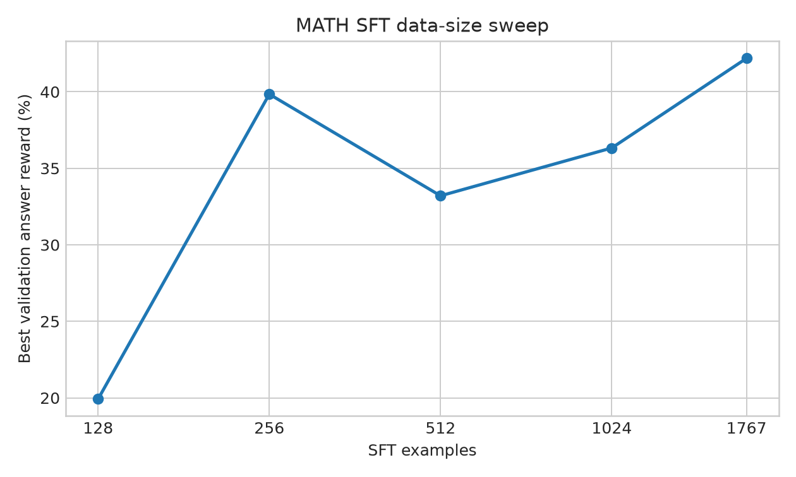
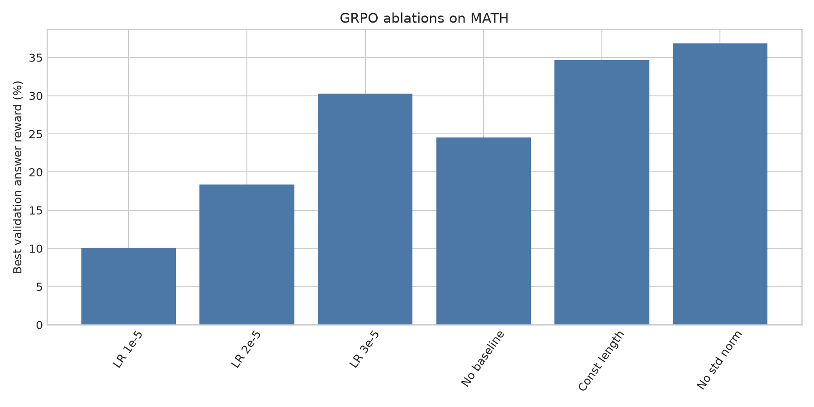
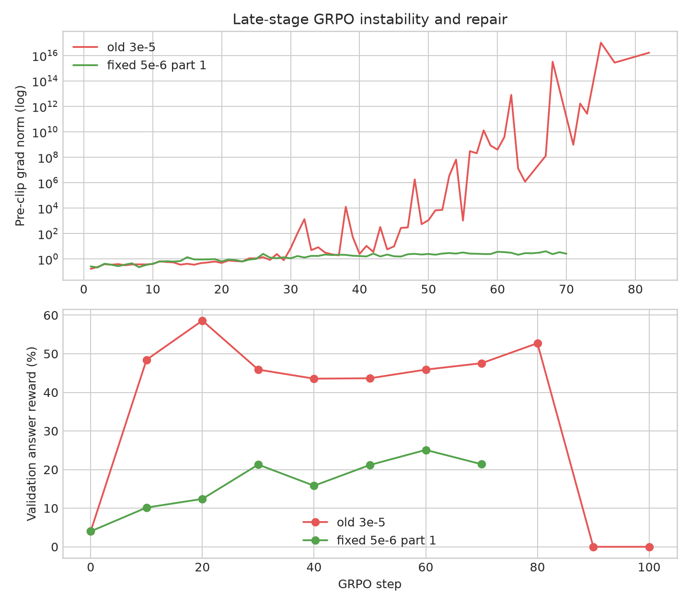

# CS336 Assignment 5 — Alignment: Experiment Results

This repository contains a complete implementation and experimental run of the Spring 2025 Assignment 5 alignment pipeline on **Qwen2.5-Math-1.5B** using two RTX 4090 GPUs. GPU 0 was used for policy optimization and GPU 1 for vLLM rollout/evaluation whenever both could safely coexist.

## Reproducibility

- Core tests: **31/31 passed** after implementation, including SFT, GRPO, packed-SFT, parser/metrics and optional DPO tests.
- Main MATH data: 7,500 train, 5,000 validation; 1,767 SFT traces and 1,408 reward-filtered SFT traces.
- All experiment commands/configuration and small/medium generated data are stored under `experiments/` and `results/`.
- Model checkpoints are intentionally not stored in normal Git because each is about 2.9 GB; checkpoint paths are recorded in run metadata.

## MATH baseline and SFT

The Qwen2.5-Math-1.5B zero-shot baseline on all 5,000 validation examples was **2.20% answer reward**.

| SFT examples | Best validation answer reward |
|---:|---:|
| 128 | 19.92% |
| 256 | 39.84% |
| 512 | 33.20% |
| 1,024 | 36.33% |
| 1,767 | 42.19% |

Filtering the 1,767 SFT examples through the assignment reward retained 1,408 examples. The filtered run reached **48.44%** on its periodic validation subset, compared with a best **42.19%** for the unfiltered full-data run. The curves are not monotone: continued optimization sometimes degraded validation reward, so checkpoint/evaluation frequency matters.

## Expert Iteration

Three EI configurations were run for five iterations. Each iteration generates grouped rollouts, keeps reward-correct traces, performs SFT on the selected expert traces, and re-evaluates the policy.

| EI configuration | Best periodic validation reward | Final periodic reward |
|---|---:|---:|
| batch 512, G=4, 1 SFT epoch | 23.44% | 18.75% |
| batch 1024, G=8, 1 SFT epoch | 25.39% | 16.41% |
| batch 2048, G=4, 2 SFT epochs | **28.12%** | **28.12%** |

The larger rollout pool and additional SFT epoch produced the strongest final EI run. Token entropy was logged during EI training to make policy concentration observable rather than relying only on reward.

## GRPO ablations

The implementation includes group-relative reward normalization, no-baseline and baseline policy-gradient variants, GRPO clipping, no-clipping, response-length normalization controls, multiple policy epochs per rollout, off-policy minibatch controls, token entropy, pre-clip gradient norm, clip fraction, and importance-ratio diagnostics.

Selected ablation results (best periodic validation answer reward):

| Experiment | Best reward |
|---|---:|
| LR 1e-5 | 10.06% |
| LR 2e-5 | 18.36% |
| LR 3e-5 | 30.27% |
| No baseline | 24.51% |
| REINFORCE with group baseline | **46.29%** |
| Constant length normalization | 34.67% |
| No group-std normalization | 36.82% |
| Off-policy, 2 epochs | 46.68% |
| Off-policy, 4 epochs / batch 128 | 46.97% |
| Focused off-policy run | **57.32%** |
| GRPO without clipping | 22.36% |
| Question-only prompt/reward ablation | **62.89%** |

The experiments strongly support using a group-relative baseline and clipping in this setup. Removing clipping substantially reduced reward. Increasing off-policy reuse can help, but it also raises the risk of policy/rollout drift and therefore interacts strongly with learning rate.

## Long-run GRPO instability and repair

The original 100-step leaderboard configuration combined `lr=3e-5`, four policy epochs per rollout and train batch 128. It did not suddenly fail at step 100: diagnostics show a progressive instability. Pre-clip gradient norm grew from ordinary values to hundreds/thousands, eventually reached infinity around the mid-60s, and loss/entropy became NaN at step 83. Continuing after that corrupted the final checkpoint.

The repair was:

1. compute log importance ratios and `exp(log_ratio)` in FP32 rather than BF16;
2. log `log_ratio_min/max` on every GRPO step;
3. fail immediately on non-finite loss or gradient norm;
4. add a maximum absolute log-ratio guard;
5. reduce long-run off-policy LR from `3e-5` to `5e-6`;
6. retain periodic recovery checkpoints while cleaning old checkpoints to avoid disk exhaustion.

The repaired run remained finite through all **100 logical GRPO steps**. The first 60 steps were run continuously and the last 40 resumed from the verified step-60 checkpoint after an unrelated `No space left on device` error during checkpoint serialization. At the end of logical step 100, pre-clip grad norm was about **1.16** and observed log-ratio range was about **[-3.125, 1.313]**, with no NaN/Inf.

## Final 5,000-example MATH evaluation

The repaired 100-step GRPO final checkpoint was evaluated on the complete 5,000-example MATH validation set:

| Metric | Result |
|---|---:|
| Answer reward / accuracy | **38.86%** |
| Format reward | **81.48%** |
| Average generated response | 288.83 tokens |

The full per-example generations and rewards are in `experiments/math_assignment/final_fixed100_eval/validation_5000.jsonl`.

For a strict apples-to-apples comparison, the final stage checkpoints were also evaluated independently on the same complete 5,000-example MATH validation set:

| Stage | Answer reward / accuracy | Format reward | Avg. response tokens |
|---|---:|---:|---:|
| Base Qwen2.5-Math-1.5B | 2.20% | 25.16% | 1,008.0 |
| SFT, 1,767 traces | 36.00% | 75.52% | 150.31 |
| Filtered SFT, 1,408 traces | **42.30%** | **97.88%** | 140.03 |
| Expert Iteration final | 22.58% | 86.26% | 227.23 |
| Repaired GRPO, 100 logical steps | 38.86% | 81.48% | 288.83 |

On this common full-validation evaluation, reward-filtered SFT is the strongest final stage checkpoint. GRPO substantially improves over the base model and the evaluated EI final checkpoint, but does not exceed filtered SFT on the full 5,000-example set. This differs from several smaller periodic validation subsets, illustrating why final conclusions should use a common evaluation population.

## Repository map

- `cs336_alignment/`: implementation of SFT, EI, GRPO, DPO helper, evaluation and training utilities.
- `tests/`: assignment adapters and tests.
- `scripts/`: data preparation, result summarization and plotting scripts.
- `data/`, `experiments/data/`: datasets used by the experiments.
- `experiments/math_assignment/`: launch configs, metrics, rollouts, generations and logs.
- `results/assignment5_summary.json`: machine-readable experiment summary.
- `plots/`: generated figures.

## Notes

Reported periodic validation values from different sweeps use the evaluation sizes recorded in each run's metadata; they are suitable for within-sweep selection but should not be treated as an exact apples-to-apples final ranking. The common 5,000-example stage evaluations are the preferred numbers for final stage-to-stage comparison.
